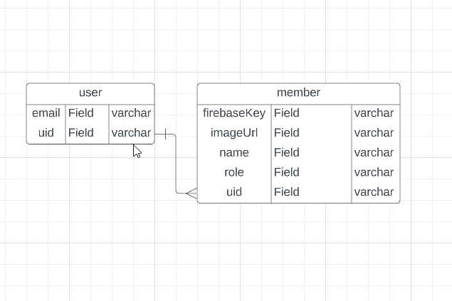
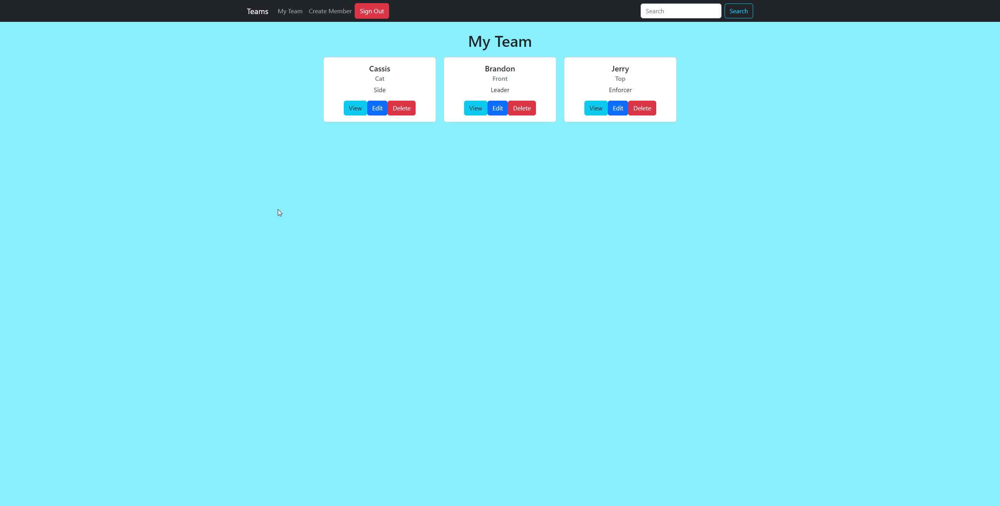
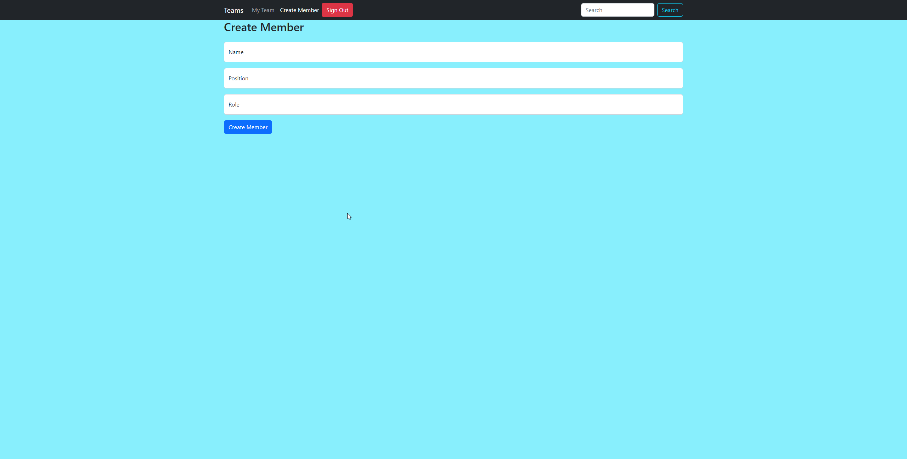
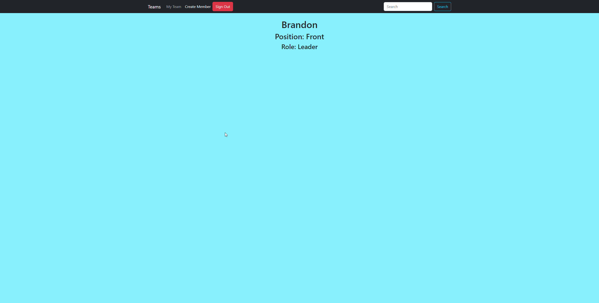

# Team Roster

## Overview
Team Roster is an application that allows users to manage their team members in an easy and efficient way. Users can add new team members, view existing members, and edit or delete them as needed. The app ensures that users can only view the members they have submitted, maintaining privacy and organization.

## Wireframe
- [Wireframe](./screenshots/wireframe.png)

## Data Flowchart

## Deployed Project
[Team Roster Live](https://bch-team-app.netlify.app/)

## User Story
As a team leader, I want to be able to manage my team members in an organized and efficient way so that I can keep track of their roles and responsibilities.

## Features
- Add new team members with their name, position, and role
- View all submitted team members
- Edit and delete existing team members
- User authentication to ensure privacy

## Screenshots

## Contributors
- [Brandon Highland](https://github.com/bhighlander)

## Walkthrough Video
[Team Roster Walkthrough](https://www.loom.com/share/298766c926ef4228887b12bf4a16030c)
